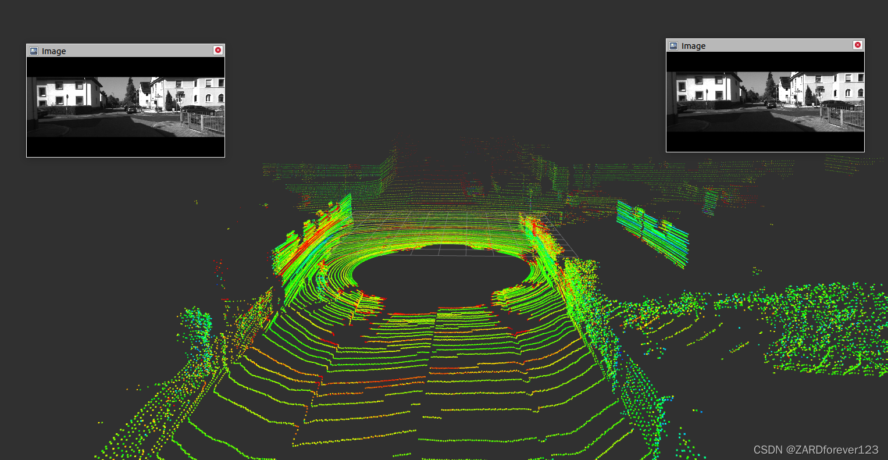
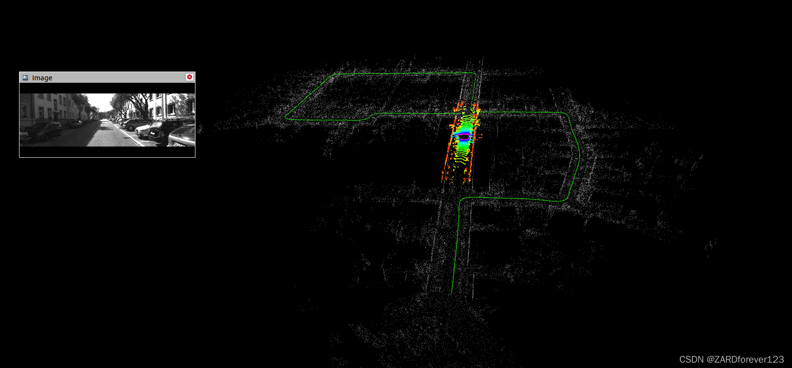

运行环境：ubuntu20 + ROS noetic

## 使用方法

1. 先git clone下来这个文件夹 

2. 在git clone下来的文件夹下运行：

   ```shell
   catkin_make
   ```

3. 接着运行以下命令：

   ```shell
   roslaunch aloam_velodyne aloam_velodyne_VLP_16.launch
   rosbag play --clock  nsh_indoor_outdoor.bag
   ```

   如果想保存地图，运行下面的程序：

   ```shell
   roslaunch aloam_velodyne aloam_velodyne_VLP_16.launch
   rosbag record -o bag_out /laser_cloud_map
   rosbag play --clock  nsh_indoor_outdoor.bag
   ```

   跑完之后 ctrl + c 关闭记录地图的终端，会生成一个bag文件，将其转化为pcd格式：

   ```shell
   rosrun pcl_ros bag_to_pcd bag_out_xxx.bag laser_cloud_map pcd
   ```


## 运行KITTI数据集

A-LOAM运行KITTI数据集需要运行kittiHelper节点，首先要将KITTI数据转换成ROS 的 Topic 或者 rosbag，读取KITTI数据集的 图像\雷达\时间戳 并发布topic和保存bag，跑之前修改launch文件：

```xml
<launch>
    <node name="kittiHelper" pkg="aloam_velodyne" type="kittiHelper" output="screen"> 
        <param name="dataset_folder" type="string" value="/data/KITTI/odometry/" />
        <param name="sequence_number" type="string" value="00" />
        <param name="to_bag" type="bool" value="false" />
        <param name="output_bag_file" type="string" value="/tmp/kitti.bag" /> <!-- replace with your output folder -->
        <param name="publish_delay" type="int" value="1" />
    </node>
</launch>
```

其中/data/KITTI/odometry/修改为kitti数据集的路径，to_bag的值可以为false或者true，选择是否将kitti数据集计算轨迹的同时打包成bag输出，输出路径为out_bag_file的值。以上文件夹路径部分需要根据自己的电脑路径进行修改，均使用绝对路径。publish_delay为发布延时。kitti 数据集的文件结构，注意这个和程序里面的路径设置有关，不一致则读不到数据（可修改源码读自己安排的路径）：

```
—kitti_data
------poses
---------00.txt
------sequence
---------00
------------image_0
------------------000000.png
------------image_1
------------------000000.png
------------calib.txt
------------times.txt
------velodye
---------sequence
------------00
---------------velodye
------------------000000.bin
```

上述文件目录中，poses文件夹下存放的是路径真值，sequences文件夹下是00文件夹，00文件夹下是图片image_0、image_1和时间戳time.txt，veledyne存放的是64线激光雷达数据，为bin文件，在后面的计算中，只使用的velodyne的数据，其它的数据在rviz中用作显示。

修改好之后，运行launch文件，打开rviz逐帧显示KITTI数据集：

```shell
roslaunch aloam_velodyne kitti_helper.launch
```



接下来运行SLAM：

```shell
roslaunch aloam_velodyne kitti_helper.launch
roslaunch aloam_velodyne aloam_velodyne_HDL_64.launch
```

